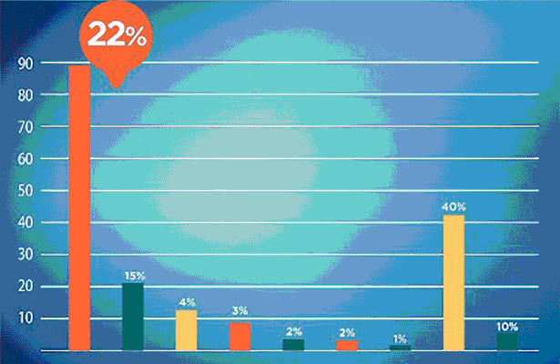
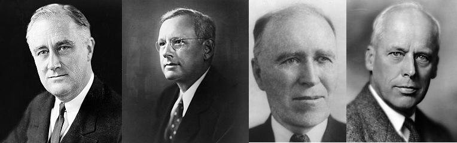

```{r, include = FALSE}
source("./config/setup.R")
library(tidyverse)
```

# Introdução

## 

::: {.block}
### Estatística
Conjunto de métodos e técnicas usados para organizar, descrever, analisar e interpretar dados.
:::

\beginAHalfColumn

 - Compreende:
   1. Planejamento (delineamento) de estudos e coleta de dados (amostragem).
   2. Descrição, análise e interpretação dos dados.

\endColumns
\beginAHalfColumn

 - Permite:
   1. Extrair informações importantes para tomada de decisões.
   2. Avaliar evidências empíricas sob hipóteses de interesse.

\endColumns

## Origem da Estatística

 - A palavra \textbf{Estatística} (\textbf{Statistics}) vem do latim \textbf{Status}, que significa \textbf{Estado}.
 
 - A Estatística tem sua origem em levantamentos de \textbf{informações} de interesse para o \textbf{Estado}.
 
 - As informações coletadas eram usadas para fins \textbf{demográficos}, \textbf{militares} e de \textbf{taxação de impostos}.
 
 - Existem \textbf{registros} de coletas de dados e algumas análises que datam de \textbf{3000 anos A.C.} em civilizações como, China, Egito, etc.
 
 - Apenas no século XVII a Estatística passou a ser considerada \textbf{disciplina autônoma} e não uma sub-área de outra disciplina.

## Origem da Estatística

 - A Estatística como área se desenvolveu muito no último século.

 - A \textbf{teoria das probabilidades} (fundamento matemático da estatística) foi desenvolvida entre os séculos XVII e XIX com base no trabalho de autores como Thomas Bayes, Pierre-Simon Laplace e Carl Gauss.

 - Ao contrário da natureza puramente teórica da probabilidade, a \textbf{Estatística é uma teoria aplicada relacionada à análise e modelagem de dados}.

 - A Estatística moderna tem sua origem no final dos anos 1800 com nomes como Francis Galton e Karl Pearson.

 - No começo do século XX, R. A. Fisher liderou o desenvolvimento da Estatística apresentando ideias como design experimental e estimação por máxima verossimilhança.

## Símbolo da Estatística

\beginAHalfColumn

 - Representa a importância da matemática na Estatística por meio do \textbf{Somatório} e da \textbf{Integral}.

\vspace{0.3cm}

 - A \textbf{engrenagem} representa a indústria, a principal área que fazia uso de métodos estatísticos quando o símbolo foi proposto (1963).

\endColumns
\beginAHalfColumn

```{r, echo = FALSE, out.width='80%', fig.align='center', fig.cap="Símbolo da Estatística."}

knitr::include_graphics("./img/simb_est.png")
```

\endColumns

# Conceitos fundamentais

## Conceitos fundamentais

 - **População**: conjunto de seres, itens ou eventos com uma característica comum. 
   - TODOS aqueles que possuem a característica de interesse pertencem à população.
 - **Amostra**: subconjunto da população.
 - **Variáveis**: características observadas em cada elemento.

Em Estatística tentamos entender o que acontece na população com base no que observamos em uma amostra. 

## População x Amostra

\beginAHalfColumn

 - O objetivo de qualquer estudo é avaliar a \textbf{população}. 

\vspace{0.3cm}

 - Nem sempre é possível coletar dados de toda a população.

\vspace{0.3cm}

 - A alternativa é trabalhar com uma \textbf{amostra}.

\vspace{0.3cm}

 - Caso toda a população seja acessível no estudo, fazemos um estudo censitário (\textbf{censo}).

\endColumns
\beginAHalfColumn

```{r, echo = FALSE, out.width='100%', fig.align='center', fig.cap="Representação população/amostra. Extraído de \\href{https://cdn.pixabay.com/photo/2017/10/25/18/18/rare-disease-2888820_1280.png}{pixabay.com.}"}

knitr::include_graphics("./img/populacao-amostra3.png")
```

\endColumns

## Exemplos

 - Existe interesse em avaliar a opinião dos \textbf{alunos da UFPR} a respeito de determinada política.
    - \textbf{População}: todos os alunos da UFPR.
    - \textbf{Amostra}: parte dos alunos da UFPR.

\vspace{0.5cm}
    
 - Um pesquisador propôs uma nova droga que tem como objetivo reduzir \textbf{cólicas menstruais}.
    - \textbf{População}: todos os indivíduos que apresentam cólicas menstruais.
    - \textbf{Amostra}: parte da população de indivíduos que apresentam cólicas.

## Etapas da análise estatística

De forma geral, as etapas para análise de um conjunto de dados são:

1. Definição do problema. 
   - Hipóteses, objetivos, população e variáveis de interesse.
2. Planejamento do estudo.
3. Coleta, limpeza e validação de dados.
4. Análise dos dados
   - Análise exploratória.
   - Aplicação de métodos mais sofisticados que permitam generalizar os resultados para a população.
5. Interpretação dos resultados.

## Alguns exemplos de aplicações de Estatística 

\beginAHalfColumn

 - \textbf{Medicina}: eficácia de tratamentos propostos.

\vspace{0.3cm}

 - \textbf{Indústria}: avaliação de qualidade de itens produzidos.

\vspace{0.3cm}

 - \textbf{Negócios}: análise do perfil dos indíviduos para concessão de crédito.

\endColumns
\beginAHalfColumn

```{r, echo = FALSE, out.width='15%', fig.align='center', fig.cap="Extraído de \\href{https://cdn.pixabay.com/photo/2018/04/06/19/39/symbol-3296654_1280.png}{pixabay.com.}"}
knitr::include_graphics("./img/pilula.png")
```

```{r, echo = FALSE, out.width='15%', fig.align='center', fig.cap="Extraído de \\href{https://cdn.pixabay.com/photo/2012/04/26/18/16/factory-42708_1280.png}{pixabay.com.}"}
knitr::include_graphics("./img/industria.png")
```

```{r, echo = FALSE, out.width='15%', fig.align='center', fig.cap="Extraído de \\href{https://pixabay.com/pt/vectors/dinheiro-saco-saco-de-dinheiro-1910761/}{pixabay.com.}"}
knitr::include_graphics("./img/dinheiro.png")
```

\endColumns

# Áreas da Estatística

## Áreas da Estatística

Em livros de Estatística básica:

1. \textbf{Estatística descritiva ou exploratória.}
    - Coleta, organização, tratamento, análise e apresentação de dados.

2. \textbf{Probabilidade.}
    - Modelagem de fenômenos aleatórios para estudar a chance de ocorrência de desfechos.

3. \textbf{Inferência estatística.}
    - Estudo da população por meio de evidência fornecida pela amostra.

## Áreas da Estatística

Fora da Estatística "básica", existem diversos temas:

\

\beginAHalfColumn

 - Métodos de amostragem.

\vspace{0.3cm}

 - Planejamento de experimentos.

\vspace{0.3cm}

 - Controle estatístico de qualidade.

\vspace{0.3cm}

 - Modelos de regressão.

\vspace{0.3cm}

 - Análise de sobrevivência.

\endColumns
\beginAHalfColumn

 - Análise de dados correlacionados.

\vspace{0.3cm}

 - Análise de séries temporais.

\vspace{0.3cm}

 - Inferência Bayesiana.

\vspace{0.3cm}

 - Aprendizado de máquina.

\vspace{0.3cm}

 - Inferência causal.

\endColumns

# Estatística e o desenvolvimento científico

## Estatística e o desenvolvimento científico

 - A Estatística está diretamente associada com o \textbf{método científico}.
   - Definimos uma \textbf{hipótese}.
   - Confrontamos esta hipótese com \textbf{evidências} (dados).
   - Com base nas evidências \textbf{rejeitamos} ou \textbf{não rejeitamos} as hipóteses iniciais.
   - Os resultados conduzem a \textbf{novas hipóteses} e o ciclo se reinicia.
 
\vspace{1cm}

 - Praticamente todas as áreas do conhecimento humano requerem instrumentos para \textbf{análise de dados}.


## A importância de resultados não significativos

\beginAHalfColumn

 - Muitos pesquisadores deixam de tornar públicos resultados não significativos.

\vspace{0.3cm}

 - Contudo resultados não significativos são tão importantes quanto os significativos.

\vspace{0.3cm}

 - A hipótese de interesse, rejeitada ou não rejeitada, fornece conhecimento a respeito do problema sob análise.

\endColumns
\beginAHalfColumn 

```{r, echo = FALSE, out.width='40%', fig.align='center', fig.cap="Extraído de \\href{https://cdn.pixabay.com/photo/2021/11/04/14/36/doubt-6768418_1280.png}{pixabay.com.}"}
knitr::include_graphics("./img/duvida.png")
```

\endColumns

# Estatística e ética

## Estatística e ética

\beginAHalfColumn

 - Cuidados devem ser tomados na escolha do tipo análise a ser realizada.

\vspace{0.3cm}

 - O uso e divulgação \textbf{ética} e \textbf{criteriosa} de dados e resultados de análises devem ser pré-requisitos \textbf{indispensáveis} e \textbf{inegociáveis} à qualquer analista. 

\endColumns
\beginAHalfColumn

```{r, echo = FALSE, out.width='75%', fig.align='center', fig.cap="Extraído de \\href{https://cdn.pixabay.com/photo/2021/11/13/18/48/devil-6792088_1280.png}{pixabay.com.}"}
knitr::include_graphics("./img/etica.png")
```

\endColumns

## Estatística e ética

\beginAThirdColumn

 - Por exemplo, no contexto de gráficos, devemos evitar que o gráfico fique desproporcional ou privilegiando determinados valores a fim de induzir conclusões àqueles que utilizam o gráfico como forma de visualização.

\endColumns
\beginTwoThirdsColumn

```{r, echo = FALSE, out.width='110%', fig.align='center', fig.cap="Exemplo de gráfico desproporcional. Extraído de \\href{https://noticias.uol.com.br/politica/eleicoes/2018/noticias/2018/05/30/psdb-sp-divulga-grafico-desproporcional-de-doria-e-tira-do-ar-apos-criticas.htm}{Uol Notícias.}"}


```

\endColumns

# Estatística e o desenvolvimento computacional

## Estatística e o desenvolvimento computacional

\beginAHalfColumn

 - A popularização da Estatística se deu graças ao desenvolvimento computacional.

\vspace{0.3cm}

 - Os computadores pessoais tornaram os métodos estatísticos mais acessíveis ao público geral por meio de  softwares que implementam as metodologias.

\endColumns
\beginAHalfColumn

```{r, echo = FALSE, out.width='60%', fig.align='center', fig.cap="Extraído de \\href{https://cdn.pixabay.com/photo/2020/04/04/04/23/graph-5000784_1280.png}{pixabay.com.}"}

knitr::include_graphics("./img/desenvolvimento-computacional.png")
```

\endColumns

## Estatística e o desenvolvimento computacional

\beginAHalfColumn

 - Devido ao avanço computacional, houve um aumento considerável na capacidade de produzir e armazenar dados provenientes das mais diversas fontes.

\vspace{0.3cm}

 - Graças ao avanço computacional podemos lidar com a manipulação de grandes conjuntos de dados.

\endColumns
\beginAHalfColumn

```{r, echo = FALSE, out.width='60%', fig.align='center', fig.cap="Extraído de \\href{https://cdn.pixabay.com/photo/2015/04/14/23/17/it-business-722950_1280.png}{pixabay.com.}"}

knitr::include_graphics("./img/ti.png")
```

\endColumns

## Estatística e o desenvolvimento computacional

\beginAHalfColumn

 - Este grande volume de dados também força o desenvolvimento dos métodos estatísticos e softwares para análise de dados.

\vspace{0.3cm}

 - A capacidade computacional atual também desperta o interesse por métodos estatísticos computacionalmente intensivos.

\endColumns
\beginAHalfColumn

```{r, echo = FALSE, out.width='60%', fig.align='center', fig.cap="Extraído de \\href{https://images.pexels.com/photos/5496463/pexels-photo-5496463.jpeg?auto=compress&cs=tinysrgb&w=1260&h=750&dpr=1}{pixabay.com.}"}

knitr::include_graphics("./img/pc.jpg")
```

\endColumns

## Considerações

 - Onde há dados e incerteza, a Estatística pode ser usada.

 - A Estatística vai muito além do senso comum: tabelas e gráficos em revistas esportivas e jornais ou pesquisas de intenção de voto em épocas de eleição.

 - Existem diversas técnicas e possíveis áreas de aplicação.
 
 - A Estatística está por trás de boa parte do desenvolvimento científico moderno.

# Algumas leituras recomendadas

## Livros técnicos

\beginAHalfColumn

```{r, echo = FALSE, out.width='50%', fig.align='center', fig.cap="Noções de Probabilidade e Estatística."}

knitr::include_graphics("./img/noproest.jpg")
```

\endColumns
\beginAHalfColumn

```{r, echo = FALSE, out.width='50%', fig.align='center', fig.cap="Estatística Básica."}

knitr::include_graphics("./img/estbas.png")
```

\endColumns

## Livros não técnicos

\beginAHalfColumn

```{r, echo = FALSE, out.width='50%', fig.align='center', fig.cap="Uma senhora toma chá."}

knitr::include_graphics("./img/cha.jpg")
```

\endColumns
\beginAHalfColumn

```{r, echo = FALSE, out.width='50%', fig.align='center', fig.cap="O andar do bêbado."}

knitr::include_graphics("./img/bebado.jpg")
```

\endColumns

## Livros não técnicos

\beginAHalfColumn

```{r, echo = FALSE, out.width='50%', fig.align='center', fig.cap="Como mentir com Estatística."}

knitr::include_graphics("./img/mentir.jpg")
```

\endColumns
\beginAHalfColumn

```{r, echo = FALSE, out.width='50%', fig.align='center', fig.cap="Algoritmos de destruição em massa."}

knitr::include_graphics("./img/algoritmos.jpg")
```

\endColumns

## Algumas frases para refletir

\beginTwoThirdsColumn

*"Em Deus nós confiamos; todos os outros devem trazer dados."*
William Edwards Deming

\vspace{1cm}

*"O trabalho do estatístico é o de catalisar o processo de construção do conhecimento científico."*
George E. P. Box

\vspace{1cm}

*"A tentação de formular teorias prematuras sobre dados insuficientes é a ruína da nossa profissão."*
Sherlock Holmes, de Sir Arthur Conan Doyle

\endColumns\hfill
\beginAThirdColumn

```{r, echo = FALSE, out.width='40%', fig.align='center'}
knitr::include_graphics("./img/deming.jpeg")
```

```{r, echo = FALSE, out.width='40%', fig.align='center'}
knitr::include_graphics("./img/box.jpeg")
```

```{r, echo = FALSE, out.width='40%', fig.align='center'}
knitr::include_graphics("./img/holmes.png")
```

\endColumns

# Dados

## O que são dados?

\beginAHalfColumn

 - Dados são \textbf{conjuntos de valores}.

\vspace{0.3cm}
 
 - Podem ser de diferentes fontes, tais como \textbf{estudos} e \textbf{experimentos}.

\vspace{0.3cm}

 - Podem conter \textbf{variáveis} de diferentes tipos.

\vspace{0.3cm}

 - Podem surgir em formatos \textbf{estruturados} e \textbf{não estruturados}.

\endColumns
\beginAHalfColumn

```{r, echo = FALSE, out.width='90%', fig.align='center', fig.cap="Extraído de \\href{https://cdn.pixabay.com/photo/2018/01/26/18/21/matrix-3109378_1280.jpg}{pixabay.com.}"}

knitr::include_graphics("./img/dados.jpg")
```

\endColumns

## Conjunto de dados

 - Em Estatística, em geral, lidamos com \textbf{dados estruturados em um formato tabular}.

 - Os dados nem sempre começam nessa forma. Muitas vezes a informação deve ser processada e tratada de modo a chegar nesta estrutura.
 
 - O conjunto de dados completo e sem tratamentos é denominado conjunto de \textbf{dados brutos}.

\vspace{0.3cm}

 - Um conjunto de dados considerado \textbf{arrumado} é aquele em que: 
   - Cada \textbf{coluna} representa uma \textbf{variável}.
   - Cada \textbf{linha} representa uma \textbf{observação}.
   - Cada \textbf{célula} representa o \textbf{valor} observado.

## Conjunto de dados

```{r, echo = FALSE, out.width='90%', fig.align='center', fig.cap="Adaptado de \\href{https://r4ds.had.co.nz/tidy-data.html}{https://r4ds.had.co.nz}."}

knitr::include_graphics("./img/tidy-data.png")
```

## Conjunto de dados

```{r, echo=FALSE}

tabela <- data.frame(ID = 1:5,
                     Sexo = c('Masculino', 'Feminino',
                              'Feminino', 'Feminino',
                              'Masculino'),
                     Escolaridade = c('Ensino superior', 
                                      'Ensino médio',
                                      'Ensino superior', 
                                      'Mestrado',
                                      'Ensino médio'),
                     Altura = c(182, 160, 160, 165, 183),
                     Peso = c(80, 46, 55, 58, 55),
                     Irmãos = c(0,1,4,3,1))

knitr::kable(tabela, caption = "Exemplo de conjunto de dados")

```

# Fontes de dados

## De onde vêm os dados?

\beginAHalfColumn

\textbf{Alguns exemplos}:

 - Estudos de caso.
 - Experimentos.
 - Pesquisas.
 - Registros administrativos.
 - Dados em repositórios online.
 - Bancos de dados corporativos.
 - Sensores.
 - Textos, imagens e vídeos.

\endColumns
\beginAHalfColumn

```{r, echo = FALSE, out.width='90%', fig.align='center', fig.cap="Extraído de \\href{https://cdn.pixabay.com/photo/2022/03/02/09/37/data-7042739_1280.png}{pixabay.com.}"}

knitr::include_graphics("./img/fontes-dados.png")
```

\endColumns

## Dados observacionais x dados experimentais

\beginAHalfColumn

\textbf{Dados observacionais}

 - \textbf{Observação passiva} da realidade. 
 - Sem modificação das condições.

\vspace{0.3cm}

\textbf{Dados experimentais}

 - \textbf{Intervenção} na realidade.
 - Condições controladas.
 - Observação dos efeitos das intervenções.
 
\endColumns
\beginAHalfColumn

```{r, echo = FALSE, out.width='90%', fig.align='center', fig.cap="Extraído de \\href{https://cdn.pixabay.com/photo/2013/07/12/15/08/earth-149499_1280.png}{pixabay.com.}"}

knitr::include_graphics("./img/observar.png")
```

\endColumns

## Dados observacionais x dados experimentais

 - Cada tipo de estudo induz \textbf{relações} diferentes entre as observações e \textbf{modelos estatísticos} diferentes para modelar a incerteza destas relações.

 - Um \textbf{conjunto de dados} é um dos subprodutos de um estudo. Ele contém as características principais (variáveis) que se tem interesse em estudar em uma população ou amostra.

 - Estas características podem ser \textbf{qualitativas} ou \textbf{quantitativas} e a partir do conjunto de dados as análises inferenciais são feitas. 
 
 - As variáveis são assim chamadas porque seus valores não são constantes e variam segundo regras ou leis naturais que podem ser conhecidas ou desconhecidas.
 
# Tipos de variáveis

## Tipos de variáveis

\vspace{0.3cm}

 - Na prática, podemos coletar variáveis de diferentes tipos e naturezas.

 - Antes de de qualquer análise precisamos ser capazes de compreender os tipos de variáveis pois estes tipos conduzirão às análises e métodos estatísticos que poderão ser aplicados.
 
\vspace{0.3cm}

 - Existem dois tipos (básicos) de variáveis:
   - Numéricas (\textbf{quantitativas}).
   - Não numéricas (\textbf{qualitativas}).

\vspace{0.3cm}

```{r, echo = FALSE, out.width='90%', fig.align='center', fig.cap="Tipos básicos de variáveis."}

knitr::include_graphics("./img/tipos-variaveis2.png")
```

## Variáveis quantitativas

\beginAHalfColumn

 - \textbf{Variáveis Quantitativas}: assumem valores numéricos.
   - \textbf{Discretas}: características mensuráveis que podem assumir apenas um número finito ou infinito \textbf{contável} de valores.
   - \textbf{Contínuas}: características mensuráveis que assumem valores em uma \textbf{escala contínua}, isto é, na reta real.

\endColumns
\beginAHalfColumn

\textbf{Exemplos}

 - Altura.
 - Peso.
 - Idade.
 - Percentual de gordura corporal.
 - Número de filhos.
 - Número de fraturas.
 - Número de faltas.
 - Número de peças defeituosas em um lote.
 
\endColumns

## Variáveis qualitativas

\beginAHalfColumn

 - \textbf{Variáveis Qualitativas}: são as características definidas por categorias, ou seja, representam uma classificação dos indivíduos e não uma característica numérica.
   - \textbf{Nominais}: não existe ordenação nem peso entre as categorias.
   - \textbf{Ordinais}: existe uma ordenação entre as categorias.

\endColumns
\beginAHalfColumn

\textbf{Exemplos}
 
 - Estado civil.
 - Orientação sexual.
 - Turma.
 - Posição em que joga em um time.
 - Severidade de uma lesão.
 - Escolaridade.
 - Grau de proficiência em língua inglesa.
 - Risco de infarto.

\endColumns

## Cuidados com variáveis

 - Existem particularidades na classificação de variáveis devido a situações como: 
   - Discretização de variáveis contínuas.
   - Limitações em instrumentos de mensuração.
   - Utilização de quantidades numéricas para representação de variáveis categóricas.
   - Dentre outras.

\vspace{0.3cm}

 - Deve-se sempre estar atento a este tipo de situação pois podem levar a implicações nas análises e consequentemente nos resultados.

 - Existem outros tipos de variáveis que ocorrem em situações particulares que requerem técnicas específicas de análise.
 
# Análise de dados

## No que devemos pensar antes de analisar nossos dados?

 - O que estamos interessados em avaliar?
 - Quais são as variáveis de interesse?
 - Quais são as variáveis que queremos avaliar se influenciam a variável de interesse?
 - Quais são os métodos disponíveis para análise de variáveis deste tipo?
 - Quais os métodos disponíveis que permitem responder nossa pergunta de pesquisa?
 - Como coletar os dados?
 - Os dados são válidos?

# Métodos de amostragem

## Amostras

\beginAHalfColumn

 - Uma amostra é um \textbf{subconjunto da população}. 

\vspace{0.3cm}  

 - Na prática costuma ser inviável trabalhar com a população toda. 

\vspace{0.3cm}

 - A alternativa então é trabalhar com uma \textbf{amostra} e \textbf{inferir} os resultados para a população. 

\vspace{0.3cm}

 - A seleção da amostra pode ser feita de diversas maneiras. 

\endColumns
\beginAHalfColumn

```{r, echo = FALSE, out.width='100%', fig.align='center', fig.cap="Extraído de \\href{https://cdn.pixabay.com/photo/2017/10/25/18/18/rare-disease-2888820_1280.png}{pixabay.com.}"}

knitr::include_graphics("./img/populacao-amostra3.png")
```

\endColumns


## Amostras
 
\beginAHalfColumn 

 - Os métodos de amostragem servem para selecionar subconjuntos da população de forma mais \textbf{representativa} possível.

\vspace{0.3cm}

 - A forma adequada de amostragem conduz a um \textbf{menor tamanho amostral} para obtenção de uma \textbf{precisão satisfatória}.

\endColumns
\beginAHalfColumn

 - São características desejáveis de uma amostra:
   - Capacidade de generalização.
   - Imparcialidade e representatividade.
   - Capacidade de medir a precisão das estimativas.

 - Podemos dividir os métodos em: 
   - Amostragem probabilística.
   - Amostragem não probabilística.

\endColumns

## Um caso clássico: a história do Literary Digest

 - O \textbf{Literary Digest} era uma revista americana de publicação semanal fundada em 1890.

 - Em 1936 ocorreu a 38ª \textbf{eleição presidencial} dos Estados Unidos.

 - Como candidatos haviam nomes como: Franklin Roosevelt, Alf Landon, William Lemke, Norman Thomas, dentre outros.

 - \textbf{Roosevelt} e \textbf{Landon} eram vistos como os favoritos.

```{r, echo = FALSE, out.width='100%', fig.align='center', fig.cap="Franklin Roosevelt, Alf Landon, William Lemke e Norman Thomas."}


```

## Um caso clássico: a história do Literary Digest
 
 - No ano da eleição, o Literary Digest conduziu uma pesquisa de intenção de votos com \textbf{mais de 10 milhões de respondentes} com base em sua base de assinantes e outras listas de indivíduos.
 
 - Enquanto isso, George Gallup, fundador da Gallup Poll, conduziu pesquisas quinzenais com apenas \textbf{2 mil indivíduos}.  
 
 - O Literary Digest previu a vitória de Landon, Gallup previu a vitória de Roosevelt. Qual dos dois acertou?

## Um caso clássico: a história do Literary Digest

O resultado da eleição foi:

 1. \textbf{Franklin D. Roosevelt, 27.752.648 de votos.}
 2. Alf Landon, 16.681.862 de votos.
 3. William Lemke, 892.378 votos.
 4. Norman Thomas, 187.910 votos.
 5. Outros, 132.901 votos.

\vspace{0.5cm}

 - Gallup acertou, Literary Digest errou. 

 - O que deu errado na pesquisa do Literary Digest?
    - A resposta é: a \textbf{composição da amostra}.

## Um caso clássico: a história do Literary Digest

 - O Literary Digest optou por \textbf{quantidade}, prestando pouca atenção ao método de seleção.

 - A amostra foi de \textbf{conveniência} e representava apenas o grupo da população com nível socioeconomico relativamente alto: seus próprios assinantes e pessoas que possuiam luxos da época como telefones.

 - Isso gerou um \textbf{viés de amostragem}, ou seja, a amostra era diferente, de modos importantes e não aleatórios, da população que deveria representar. Ou simplesmente: \textbf{a amostra não era representativa}.

 - Por outro lado, a amostra de Gallup era bem mais modesta, contudo o método de seleção gerou uma \textbf{amostra representativa da população} em que todas as camadas de votantes estavam presentes.

## Amostragem probabilística

\beginAHalfColumn

 - Amostragem probabilística deve ser usada \textbf{sempre que possível}.

\vspace{0.3cm}

 - O objetivo é dimensionar amostras que sejam capazes de \textbf{estimar} as quantidades de interesse com uma certa \textbf{precisão} desejada.

\vspace{0.3cm}

 - Existem diversos métodos disponíveis.

\endColumns
\beginAHalfColumn

\textbf{Alguns métodos são:}

 - Amostragem aleatória simples (com ou sem reposição).
 - Amostragem sistemática.
 - Amostragem estratificada.
 - Amostragem por conglomerados.

\endColumns

## Amostragem não probabilística

 - Em muitos casos não é possível fazer uso de métodos de amostragem probabilística.
 
 - Surgem então os métodos de amostragem não probabilística, como amostragem por conveniência, intencional/julgamento, bola de neve.

 - Uma avaliação da “representatividade” dos métodos de amostragem não probabilística não pode ser feita.
 
 - Devemos tomar muito cuidado ao interpretar resultados baseados em métodos de amostragem não probabilísticos.
 
 - Em geral, estas amostras carregam um alto risco de não serem representativas. 
 
 - Não há métodos para análise probabilística ou inferencial dos resultados.
 
# Análise exploratória

## Análise exploratória

 - Parte primordial de qualquer análise estatística é chamada \textbf{análise descritiva} ou \textbf{exploratória}.
 
 - Consiste basicamente de \textbf{tabelas}, \textbf{resumos numéricos} e \textbf{análises gráficas} das variáveis disponíveis em um conjunto de dados.
 
 - Trata-se de uma etapa de extrema importância e deve preceder qualquer análise mais sofisticada.

 - As técnicas de análise exploratória visam \textbf{resumir} e \textbf{apresentar} as informações de um conjunto de dados brutos.

## Análise exploratória

\beginAHalfColumn

 - A análise exploratória de dados é uma área relativamente nova.

\vspace{0.3cm}

 - Nasceu do clássico livro \textbf{Exploratory Data Analysis} de \textbf{John Tukey} em 1977.

\vspace{0.3cm}

 - Algo curioso é que Tukey tinha uma relação próxima com a Ciência da Computação e definiu os termos \textbf{bit} e \textbf{software}.

\endColumns
\beginAHalfColumn

```{r, echo = FALSE, out.width='62%', fig.align='center', fig.cap="Capa do livro Exploratory Data Analysis de John Tukey."}

knitr::include_graphics("./img/eda-tukey.jpg")
```

\endColumns

## Análise exploratória

 - Como quase tudo em análise de dados, o \textbf{avanço computacional} permitiu com que a análise exploratória evoluísse substancialmente.

 - Por exemplo: historicamente o processo de criação de um gráfico era reservado a pessoas qualificadas pois a produção de uma visualização era difícil. 

 - Hoje qualquer pessoa pode inserir dados em um aplicativo e gerar um gráfico.

 - Este tipo de facilidade é importante para disseminação e democratização dos métodos, porém abre margem para certas práticas inadequadas.

## Análise exploratória

\beginAHalfColumn

 - Tentar compreender um conjunto de dados sem algum método que permita resumir as informações é inviável.

\vspace{0.3cm}

 - A análise exploratória é a primeira forma de tentarmos entender o que acontece nos nossos dados.

\vspace{0.3cm}

 - Uma das tarefas é a etapa de consistência dos dados, isto é, verificar se os dados coletados são condizentes com a realidade.

\endColumns
\beginAHalfColumn

```{r, echo = FALSE, out.width='90%', fig.align='center', fig.cap="Extraído de \\href{https://cdn.pixabay.com/photo/2018/01/26/18/21/matrix-3109378_1280.jpg}{pixabay.com.}"}

knitr::include_graphics("./img/dados.jpg")
```

\endColumns

## Análise exploratória

\beginAHalfColumn

 - O conjunto de técnicas aplicáveis está diretamente associado ao \textbf{tipo das variáveis de interesse} (quantitativas x qualitativas) e suas ramificações.

\vspace{0.3cm}

 - Podemos conduzir análises focadas nas variáveis uma a uma (\textbf{análises univariadas}).

\vspace{0.3cm}

 - Também podemos conduzir análises focadas em avaliar a relação entre as variáveis (\textbf{análises multivariadas}).

\endColumns
\beginAHalfColumn

```{r, echo = FALSE, out.width='80%', fig.align='center', fig.cap="Extraído de \\href{https://cdn.pixabay.com/photo/2020/08/03/10/00/graph-5459708_1280.png}{pixabay.com.}"}

knitr::include_graphics("./img/exploratoria.png")
```

\endColumns

## Análise exploratória

Podemos fazer uso diversas técnicas, tais como

\beginAHalfColumn

 - Tabelas de frequência absolutas.
 - Tabelas de frequência relativas.
 - Tabelas de frequência acumuladas.
 - Tabelas para múltiplas variáveis.
 - Gráficos.

\endColumns
\beginAHalfColumn

 - Medidas de posição central.
 - Medidas de posição relativa.
 - Medidas de forma.
 - Medidas de dispersão.
 - Medidas de associação.

\endColumns

## Análise exploratória

\beginAHalfColumn

 - Para ilustrar as técnicas de análise exploratória de dados, usaremos o conjunto de dados "milsa".

\vspace{0.3cm} 

 - Este conjunto de dados aparece no livro "Estatística Básica" de W. O. Bussab e P. A. Morettin.

\vspace{0.3cm}

 - Conjunto de dados hipotético de atributos de 36 funcionários da companhia "Milsa".

\endColumns
\beginAHalfColumn

O conjunto possui as seguintes variáveis: 

  - \textbf{Funcionário}: identificadora de funcionário.
  - \textbf{Estado civil}: casado ou solteiro.
  - \textbf{Instrução}: 1º grau, 2º grau, superior.
  - \textbf{Filhos}: número de filhos.
  - \textbf{Salário}: salário do funcionário.
  - \textbf{Anos}: idade em anos completos.
  - \textbf{Meses}: meses além dos anos completos.
  - \textbf{Região}: capital, interior, outro.

\endColumns

## Análise exploratória

```{r, echo=FALSE}
milsa <- read.csv("milsa.csv")

recorte <- milsa[1:10,]

names(recorte) <- c('Funcionário', 'Estado civil',
                    'Instrução', 'Filhos', 'Salário',
                    'Anos', 'Meses', 'Região')

knitr::kable(recorte, 
             caption = "Primeiras linhas do conjunto de dados Milsa.", 
             align = "c")
```

# Análise descritiva univariada para variáveis qualitativas

## Análise descritiva univariada para variáveis qualitativas

 - Uma variável qualitativa representa um atributo que pode ser expresso por meio de \textbf{rótulos} ou \textbf{categorias}.

 - Podem ser classificadas em \textbf{nominais} (sem ordenação natural entre as categorias) ou \textbf{ordinais} (com ordenação natural entre as categorias).
 
 - As categorias também são chamadas de \textbf{classes} ou \textbf{níveis}.

 - Na análise descritiva de uma variável qualitativa estamos interessados em avaliar as \textbf{frequências} das classes.
 
## Tipos de frequência

 - \textbf{Frequência absoluta} ($f_a$): número de observações no conjunto de dados que pertence a uma determinada classe.

 - \textbf{Frequência relativa} ($f_r$): frequência de classe dividida pelo número total de observações no conjunto de dados.
   - Pode ser apresentada em forma de percentual, quando multiplicada por 100.

 - \textbf{Frequência acumulada} ($F_a$ ou $F_r$): frequência absoluta ou relativa acumulada conforme disposição das classes.
   - Não faz muito sentido para variáveis qualitativas nominais.

## Tabelas de frequência para uma variável qualitativa

\beginAHalfColumn

 - Utlizando apenas os dados brutos é difícil responder questões de interesse.

\vspace{0.3cm}

 - Para reduzir os dados originais de forma que fique mais claro o entendimento dos mesmos são utilizadas as \textbf{tabelas de frequência}.

\vspace{0.3cm}

 - No caso de variáveis qualitativas consiste em listar os possíveis níveis da variável e fazer a contagem de quantas vezes cada nível aparece nos dados brutos. 

\endColumns
\beginAHalfColumn

```{r, echo = FALSE, out.width='40%', fig.align='center', fig.cap="Extraído de \\href{https://cdn.pixabay.com/photo/2016/12/11/01/28/spreadsheet-icon-1898557_1280.png}{pixabay.com.}"}

knitr::include_graphics("./img/tabela.png")
```

\endColumns

## Tabelas de frequência para uma variável qualitativa

 - Cada \textbf{linha} da tabela diz respeito a um \textbf{nível} da variável.
 
 - As \textbf{colunas} podem apresentar diferentes tipos de \textbf{frequência} (absoluta, relativa).

 - Alguns cuidados para a apresentação dos resultados dizem respeito ao tipo de variável em questão: nominal ou ordinal.

 - Os níveis de variáveis \textbf{nominais não apresentam uma ordenação natural}, portanto, na apresentação dos resultados pode ser interessante \textbf{ordenar} os níveis \textbf{por frequência} ou \textbf{por ordem alfabética}.

 - Esta estratégia não é recomendada para variáveis \textbf{ordinais}, pois estas \textbf{apresentam uma ordenação natural} e esta ordenação deve ser preferencialmente mantida na exposição dos resultados.
 
## Tabelas de frequência para uma variável qualitativa nominal

```{r, echo=FALSE}
#quest <- read.csv("respostas/estbas.csv")

tabela1 <- milsa %>%
  group_by(regiao) %>%
  summarize(Frequência = n()) %>%
  mutate(`Freq. Relativa` = round(Frequência/sum(Frequência), 2))

names(tabela1)[1] <- 'Região'

tabela1 <- 
  tabela1 %>% 
  add_row(Região = 'Total', 
          Frequência = sum(tabela1$Frequência),
          `Freq. Relativa` = sum(tabela1$`Freq. Relativa`))

knitr::kable(tabela1, 
             caption = "Tabela de frequências para a região.", 
             align ="ccc" )
```

## Tabelas de frequência para uma variável qualitativa nominal

```{r, echo=FALSE}

tabela1 <- milsa %>%
  group_by(regiao) %>%
  summarize(Frequência = n()) %>%
  mutate(`Freq. Relativa` = Frequência/sum(Frequência)) %>% 
  arrange(desc(Frequência))

tabela1 <- 
  tabela1 %>% 
  add_row(regiao = 'Total', 
          Frequência = sum(tabela1$Frequência),
          `Freq. Relativa` = sum(tabela1$`Freq. Relativa`)
          )
          
names(tabela1)[1] <- "Região" 
tabela1$`Freq. Relativa` <- round(tabela1$`Freq. Relativa`, 2)

knitr::kable(tabela1, 
             caption = "Tabela de frequências para a região.", 
             align ="ccc" )
```

## Tabelas de frequência para uma variável qualitativa nominal

```{r, echo=FALSE}

tabela1 <- milsa %>%
  group_by(regiao) %>%
  summarize(Frequência = n()) %>%
  mutate(`Freq. Relativa` = Frequência/sum(Frequência)) %>% 
  mutate(Percentual = paste(round(`Freq. Relativa`, 2)*100, "%")) %>% 
  arrange(desc(Frequência))

tabela1 <- 
  tabela1 %>% 
  add_row(regiao = 'Total', 
          Frequência = sum(tabela1$Frequência),
          `Freq. Relativa` = sum(tabela1$`Freq. Relativa`),
          Percentual = paste(sum(tabela1$`Freq. Relativa`)*100, "%"))

names(tabela1)[1] <- "Região" 

knitr::kable(tabela1[,c(1,2,4)], 
             caption = "Tabela de frequências para a região.", 
             align ="ccc" )
```

## Tabelas de frequência para uma variável qualitativa ordinal

```{r, echo=FALSE}

milsa$instrucao <- factor(milsa$instrucao,
                          levels = c("1o Grau",
                                     "2o Grau",
                                     "Superior"))

tabela2 <- as.data.frame(table(milsa$instrucao))

names(tabela2) <- c('Instrução', 'Frequência')

tabela2 <- tabela2 %>%
  mutate(`Freq. Relativa` = Frequência/sum(Frequência)) %>% 
  #mutate(Percentual = paste(`Freq. Relativa`*100, "%")) %>% 
  mutate(`Freq. Acumulada` = cumsum(Frequência)) %>% 
  mutate(`Freq. Rel. Acumulada` = cumsum(`Freq. Relativa`)) #%>% 
#mutate(`Percentual Acumulado` = paste(`Freq. Rel. Acumulada`*100, "%"))

tabela2 <- 
  tabela2 %>% 
  add_row(Instrução = 'Total', 
          Frequência = sum(tabela2$Frequência),
          `Freq. Relativa` = sum(tabela2$`Freq. Relativa`),
          #Percentual = paste(sum(tabela2$`Freq. Relativa`)*100, "%"),
          `Freq. Acumulada` = sum(tabela2$Frequência),
          `Freq. Rel. Acumulada` = sum(tabela2$`Freq. Relativa`)#,
          #`Percentual Acumulado` = paste(sum(tabela2$`Freq. Relativa`)*100, "%")
  )

tabela2$`Freq. Relativa` <- round(tabela2$`Freq. Relativa`, 2)
tabela2$`Freq. Rel. Acumulada` <- round(tabela2$`Freq. Rel. Acumulada`, 2)

names(tabela2)[1] <- "Instrução" 

knitr::kable(tabela2, 
             caption = "Tabela de frequências para o grau de instrução.", 
             align ="c" )
```

## Tabelas de frequência para uma variável qualitativa ordinal

```{r, echo=FALSE}

tabela2 <- as.data.frame(table(milsa$instrucao))

names(tabela2) <- c('Instrução', 'Frequência')

tabela2 <- tabela2 %>% mutate(`Freq. Relativa` = round(Frequência/sum(Frequência), 2)) %>% 
  mutate(Percentual = paste(`Freq. Relativa`*100, "%")) %>% 
  mutate(`Freq. Acumulada` = cumsum(Frequência)) %>% 
  mutate(`Freq. Rel. Acumulada` = cumsum(`Freq. Relativa`)) %>% 
  mutate(`Percentual Acumulado` = paste(`Freq. Rel. Acumulada`*100, "%"))


tabela2 <- 
  tabela2 %>% 
  add_row(Instrução = 'Total', 
          Frequência = sum(tabela2$Frequência),
          `Freq. Relativa` = sum(tabela2$`Freq. Relativa`),
          Percentual = paste(sum(tabela2$`Freq. Relativa`)*100, "%"),
          `Freq. Acumulada` = sum(tabela2$Frequência),
          `Freq. Rel. Acumulada` = sum(tabela2$`Freq. Relativa`),
          `Percentual Acumulado` = paste(sum(tabela2$`Freq. Relativa`)*100, "%"))

knitr::kable(tabela2[,c(1,2,4,5,7)], 
             caption = "Tabela de frequências para o grau de instrução.", 
             align ="c")
```

## Gráficos para representação de frequências de uma variável qualitativa

\beginAHalfColumn

 - A representação por meio de tabelas é útil mas nem sempre eficiente.

\vspace{0.3cm} 

 - Em diversos casos pode ser mais conveniente utilizar um \textbf{gráfico}.

\vspace{0.3cm}

 - "Uma imagem vale mais que mil palavras".

\vspace{0.3cm}

 - Os cuidados com a ordenação dos níveis de acordo com o tipo da variável se mantém.

\endColumns
\beginAHalfColumn

Algumas possibilidades são:

 - Gráfico de barras verticais.
 - Gráfico de barras horizontais.
 - Gráfico de barras empilhadas.
 - Gráfico de setores.

\endColumns

## Gráfico de barras

\textbf{Gráfico de barras verticais ou horizontais.}

  - Utiliza os possíveis \textbf{níveis} das variáveis \textbf{em um eixo}.
  - As \textbf{frequências ou porcentagens} ficam \textbf{no outro eixo}. 
  - O tamanho da barra corresponde à frequência ou percentual.

\vspace{0.5cm}
 
\textbf{Gráfico de barras empilhadas}.

  - Usa-se \textbf{uma única barra}.
  - A barra é dividida de acordo com a \textbf{contribuição relativa} de cada nível da variável.
  - Representa-se a frequência relativa ou o percentual.

 
## Gráfico de barras verticais

```{r, echo=FALSE, fig.cap="Gráfico de barras verticais para a região."}

tabela1 <- as.data.frame(table(milsa$regiao))
names(tabela1) <- c("Níveis", "Frequência")

ggplot(data=tabela1, 
       aes(x=Níveis, 
           y=Frequência#, 
           #fill = Niveis
       )) + 
  geom_bar(stat="identity", 
           col=1,
           lwd=1)+
  ylim(c(0, 
         (max(tabela1[-nrow(tabela1),]$Frequência)+ (max(tabela1[-nrow(tabela1),]$Frequência)*0.2))))+
  geom_text(aes(label=Frequência), 
            vjust=-1, 
            color=1, 
            size=8)+
  ylab("Frequência") +
  xlab("") +
  #ggtitle("Gráfico de barras para o meio de transporte dos alunos.")+
  theme_classic() + theme(#legend.position = 'bottom',
    plot.title = element_text(family = "Helvetica", 
                              face = "bold", 
                              size = (20),
                              hjust = 0.5),
    axis.title = element_text(face = "bold",
                              size = 15),
    #axis.text = element_blank(),
    legend.title = element_blank(),
    text = element_text(size=15)) 

```

## Gráfico de barras verticais

```{r, echo=FALSE, fig.cap="Gráfico de barras verticais para a região."}

ggplot(data=tabela1, 
       aes(x=reorder(Níveis, -Frequência), 
                       y=Frequência#, 
                       #fill = Niveis
                       )) + 
  geom_bar(stat="identity", 
           col=1,
           lwd=1)+
  ylim(c(0, 
         (max(tabela1[-nrow(tabela1),]$Frequência)+ (max(tabela1[-nrow(tabela1),]$Frequência)*0.2))))+
  geom_text(aes(label=Frequência), 
            vjust=-1, 
            color=1, 
            size=8)+
  ylab("Frequência") +
  xlab("") +
  #ggtitle("Gráfico de barras para o meio de transporte dos alunos.")+
  theme_classic() + theme(#legend.position = 'bottom',
    plot.title = element_text(family = "Helvetica", 
                              face = "bold", 
                              size = (20),
                              hjust = 0.5),
    axis.title = element_text(face = "bold",
                              size = 15),
    #axis.text = element_blank(),
    legend.title = element_blank(),
    text = element_text(size=15)) 
```

## Gráfico de barras horizontais

```{r, echo=FALSE, fig.cap="Gráfico de barras horizontais para a região."}

tabela1 <- as.data.frame(table(milsa$regiao))
names(tabela1) <- c("Níveis", "Frequência")

ggplot(data = tabela1, 
       aes(x = reorder(Níveis, Frequência), 
           y = Frequência)) +
  geom_bar(stat = 'identity',
           col = 1,
           lwd = 1) +  
  ylim(c(0, 
         (max(tabela1[-nrow(tabela1),]$Frequência)+ (max(tabela1[-nrow(tabela1),]$Frequência)*0.1))))+
  coord_flip() +
  geom_text(aes(label = Frequência),
            hjust=-0.5, 
            color=1, 
            size=5)+
  ylab("") +
  xlab("") +
  #ggtitle("Gráfico de barras horizontais para a situação de emprego")+
  theme_classic() + theme(legend.position = 'none',
                          plot.title = element_text(family = "Helvetica", 
                                                    face = "bold", 
                                                    size = (20),
                                                    hjust = 0.5),
                          axis.title = element_text(face = "bold",
                                                    size = 15),
                          axis.text.x=element_blank(),
                          text = element_text(size=20))


```

## Gráfico de barras empilhadas

```{r, echo=FALSE, fig.cap="Gráfico de barras empilhadas para a região."}

tabela1 <- milsa %>%
  group_by(regiao) %>%
  summarize(Frequência = n()) %>%
  mutate(`Freq. Relativa` = Frequência/sum(Frequência)) %>% 
  mutate(Percentual = paste(round(`Freq. Relativa`, 2)*100, "%")) %>% 
  arrange(desc(Frequência))

tabela1 <- 
  tabela1 %>% 
  add_row(regiao = 'Total', 
          Frequência = sum(tabela1$Frequência),
          `Freq. Relativa` = sum(tabela1$`Freq. Relativa`),
          Percentual = paste(sum(tabela1$`Freq. Relativa`)*100, "%"))

names(tabela1)[1] <- "Região" 

ggplot(data=tabela1[-nrow(tabela1),], aes(x=1, 
                                          y=`Freq. Relativa`, 
                                          fill = Região
)) + 
  geom_col(col = 1) +
  geom_text(aes(label = Percentual),
            position = position_stack(vjust = 0.5),
            size = 8) +
  ylab("Percentual") +
  xlab("") +
  #ggtitle("Gráfico")+
  theme_classic() + theme(#legend.position = 'bottom',
    plot.title = element_text(family = "Helvetica", 
                              face = "bold", 
                              size = (20),
                              hjust = 0.5),
    axis.title = element_text(face = "bold",
                              size = 15),
    axis.text.x = element_blank(),
    legend.title = element_blank(),
    text = element_text(size=15))  +
  scale_fill_brewer(palette="Paired")


```

## Gráfico de setores

 - Consiste em \textbf{repartir um círculo} em setores de tamanhos proporcionais às \textbf{frequências relativas} ou às \textbf{porcentagens} de cada valor.
 - Pode ser usados para representar variáveis com \textbf{poucos níveis}.
 - Apesar de muito usado e preferido em diversas áreas, \textbf{deve ser evitado}.
 - O cérebro humano tem dificuldade em relacionar \textbf{frequências} com \textbf{áreas relativas}.
 - Para variáveis com muitos níveis, o gráfico tende a ficar \textbf{visualmente poluído} e \textbf{pouco informativo}.
 - Outro problema é que níveis com \textbf{frequências iguais a 0 deixam de aparecer no gráfico}, diferente de um gráfico de barras. 


## Gráfico de setores

```{r, echo=FALSE, fig.cap="Gráfico de setores para a região"}

tabela1 <- tabela1[-nrow(tabela1),] %>% 
  arrange(desc(Região)) %>%
  mutate(ypos = cumsum(`Freq. Relativa`)- 0.5*`Freq. Relativa`)

ggplot(tabela1, 
       aes(x="", y=`Freq. Relativa`, fill=Região)) +
  geom_bar(stat="identity", 
           width=1,
           col = 1,
           lwd = 1) +
  coord_polar("y", start=0) +
  theme_classic() + 
  #theme(legend.position="none") +
  geom_text(aes(y = ypos, label = Percentual), 
            color = 1, 
            size = 5)+
  ylab("") +
  xlab("") +
  #ggtitle("Gráfico")+
  theme(legend.position = 'right',
        plot.title = element_text(family = "Helvetica", 
                                  face = "bold", 
                                  size = (20),
                                  hjust = 0.5),
        axis.title = element_text(face = "bold",
                                  size = 15),
        axis.text = element_blank(),
        legend.title = element_blank(),
        text = element_text(size=20)) +
  scale_fill_brewer(palette="Paired")
```

# Análise descritiva univariada para variáveis quantitativas

## Análise descritiva univariada para variáveis quantitativas

 - Uma variável quantitativa é uma \textbf{característica} que pode ser \textbf{mensurada} e representada \textbf{numericamente}.
 
 - Podem ser classificadas em \textbf{discretas} (finitos valores em um dado intervalo) ou \textbf{contínuas} (infinitos valores em um dado intervalo).

 - Quando estamos lidando com \textbf{variáveis quantitativas discretas com poucos possíveis valores}, as técnicas apresentadas para variáveis qualitativas se aplicam.

## Tabelas de frequência

```{r, echo=FALSE}

milsa$filhos <- factor(milsa$filhos,
                       levels = 0:5)

tabela3 <- as.data.frame(table(na.omit(milsa)$filhos))
names(tabela3) <- c("Filhos", "Frequência")

tabela3 <- tabela3 %>%
  mutate(`Freq. Relativa` = round(Frequência/sum(Frequência),3)  ) %>% 
  mutate(Percentual = paste(`Freq. Relativa`*100, "%")) %>% 
  mutate(`Freq. Acumulada` = cumsum(Frequência)) %>% 
  mutate(`Freq. Rel. Acumulada` = cumsum(`Freq. Relativa`)) %>% 
  mutate(`Percentual Acumulado` = paste(`Freq. Rel. Acumulada`*100, "%"))


tabela3$Filhos <- as.character(tabela3$Filhos)

tabela3 <-
  tabela3 %>%
  add_row(Filhos = 'Total',
          Frequência = sum(tabela3$Frequência),
          `Freq. Relativa` = round(sum(tabela3$`Freq. Relativa`),2),
          Percentual = paste(sum(tabela3$`Freq. Relativa`)*100, "%"),
          `Freq. Acumulada` = sum(tabela3$Frequência),
          `Freq. Rel. Acumulada` = sum(tabela3$`Freq. Relativa`),
          `Percentual Acumulado` = paste(sum(tabela3$`Freq. Relativa`)*100, "%"))

knitr::kable(tabela3[,c(1,2,4,5,7)], 
             caption = "Tabela de frequências para o número de filhos (desconsiderando dados ausentes).", 
             align ="ccccccc" )

```

## Gráfico de barras verticais

```{r, echo=FALSE, fig.cap="Gráfico de barras verticais para o número de filhos."}

tabela3$Filhos <- as.numeric(tabela3$Filhos)

ggplot(data=tabela3[-nrow(tabela3),], 
       #data=tabela3, 
       aes(x=Filhos, 
           y=Frequência#, 
                       #fill = Niveis
                       )) + 
  geom_bar(stat="identity", 
           col=1,
           lwd=1)+
  ylim(c(0, 
         (max(tabela3[-nrow(tabela3),]$Frequência)+ (max(tabela3[-nrow(tabela3),]$Frequência)*0.2))))+
  geom_text(aes(label=Frequência), 
            vjust=-1, 
            color=1, 
            size=8)+
  ylab("Frequência") +
  xlab("") +
  #ggtitle("Gráfico")+
  theme_classic() + theme(#legend.position = 'bottom',
    plot.title = element_text(family = "Helvetica", 
                              face = "bold", 
                              size = (20),
                              hjust = 0.5),
    axis.title = element_text(face = "bold",
                              size = 15),
    #axis.text = element_blank(),
    legend.title = element_blank(),
    text = element_text(size=15)) +
  scale_x_continuous(breaks=tabela3[-nrow(tabela3),]$Filhos)

```

## Análise descritiva univariada para variáveis quantitativas

 - Para variáveis quantitativas \textbf{contínuas} ou \textbf{discretas com muitos possíveis valores}, precisamos de técnicas específicas.
 
 - Uma estratégia comum é o \textbf{agrupamento em faixas de valores}, e avaliação das frequências nestas faixas.

 - Podem ser usadas \textbf{tabelas de frequências} absolutas, relativas e acumuladas para as faixas de valores.

 - Utilizando a \textbf{razão entre frequência relativa e a amplitude das faixas} de valores, geramos a \textbf{densidade}.

## Análise descritiva univariada para variáveis quantitativas

\textbf{Faixas de valores}

\beginAHalfColumn

 - Cuidados devem ser tomados quanto às notações e tipos de faixas (aberto e fechado à esquerda ou direita).

\vspace{0.5cm}

 - Diferentes pessoas e softwares podem usar intervalos distintos.

\vspace{0.5cm}

 - Em geral usaremos intervalos \textbf{fechados à esquerda} e \textbf{abertos à direita}.
 
\vspace{0.5cm}

 - Considerando dois valores $a$ e $b$, em que $a < b$, os intervalos consideram que $a$ **não** está incluído na faixa, $b$ está.

\endColumns
\beginAHalfColumn
 
 - Notações usuais:
    - $a \leq y < b$.
    - $a \vdash b$. 
    - $[a,b)$.
    - $[a,b[$.

 - Exemplo:    
    - $5 \leq y < 10$.
    - $5 \vdash 10$. 
    - $[5,10)$.
    - $[5,10[$.
   - Valores maiores ou iguais a 5 até valores menores que 10 (10 não está no intervalo).

\endColumns

## Análise descritiva univariada para variáveis quantitativas

Perguntas que surgem são:

 - Como agrupar em classes?

 - Qual o tamanho ideal das faixas de valores?

\vspace{0.5cm}

 - Classes definidas com a \textbf{mesma amplitude} é o procedimento mais usual, apesar de ser possível definir classes com tamanhos diferentes.

 - Existem procedimentos que podem ser usados para obter a amplitude, como \textbf{Sturges}.
 
 - Em geral, \textbf{5} a \textbf{15} faixas são suficientes.
 
## Tabelas de frequência para uma variável quantitativa

```{r, echo=FALSE}
breaks <- hist(milsa$salario, plot = FALSE)$breaks

classes <- cut(milsa$salario, 
               breaks = breaks, 
               include.lowest = TRUE, 
               right = FALSE)

tabela4 <- as.data.frame(table(classes)) 

names(tabela4) <- c("Faixas", "Frequência")

tabela4 <- 
  tabela4 %>%
  mutate(`Freq. Relativa` = round(Frequência/sum(Frequência),2),
         Percentual = paste(`Freq. Relativa`*100, "%"),
         `Freq. Acumulada` = cumsum(Frequência),
         `Freq. Rel. Acumulada` = cumsum(`Freq. Relativa`),
         `Percentual Acumulado` = paste(`Freq. Rel. Acumulada`*100, "%"),
         Amplitude = diff(breaks)[1],
         Densidade = `Freq. Relativa`/Amplitude)

tabela4$Faixas <- as.vector(tabela4$Faixas)
tabela4[11,1] <- 'Total'
tabela4[11,2] <- sum(tabela4$Frequência[1:10])
tabela4[11,3] <- sum(tabela4$`Freq. Relativa`[1:10])
tabela4[11,c(4,5,6,7,8,9)] <- ''

knitr::kable(tabela4[,c(1,2,3,5,6)], 
             caption = "Tabela de frequências usando faixas de salários.", 
             align ="ccc" )

```

## Tabelas de frequência para uma variável quantitativa

```{r, echo=FALSE}
breaks <- hist(milsa$salario, plot = FALSE)$breaks

classes <- cut(milsa$salario, 
               breaks = breaks, 
               include.lowest = TRUE, 
               right = FALSE)

tabela4 <- as.data.frame(table(classes)) 

names(tabela4) <- c("Faixas", "Frequência")

tabela4 <- 
  tabela4 %>%
  mutate(`Freq. Relativa` = round(Frequência/sum(Frequência),2),
         Percentual = paste(`Freq. Relativa`*100, "%"),
         `Freq. Acumulada` = cumsum(Frequência),
         `Freq. Rel. Acumulada` = cumsum(`Freq. Relativa`),
         `Percentual Acumulado` = paste(`Freq. Rel. Acumulada`*100, "%"),
         Amplitude = diff(breaks)[1],
         Densidade = `Freq. Relativa`/Amplitude)

tabela4$Faixas <- as.vector(tabela4$Faixas)
tabela4[11,1] <- 'Total'
tabela4[11,2] <- sum(tabela4$Frequência[1:10])
tabela4[11,4] <- '100%'
tabela4[11,c(5,7)] <- ''

knitr::kable(tabela4[,c(1,2,4,5,7)], 
             caption = "Tabela de frequências usando faixas de salários.", 
             align ="ccc" )

```

## Tabelas de frequência para uma variável quantitativa

```{r, echo=FALSE}
breaks <- hist(milsa$salario, plot = FALSE)$breaks

classes <- cut(milsa$salario, 
               breaks = breaks, 
               include.lowest = TRUE, 
               right = FALSE)

tabela4 <- as.data.frame(table(classes)) 
  
names(tabela4) <- c("Faixas", "Frequência")

tabela4 <- 
  tabela4 %>%
  mutate(`Freq. Relativa` = round(Frequência/sum(Frequência),2),
         Percentual = paste(`Freq. Relativa`*100, "%"),
         `Freq. Acum.` = cumsum(Frequência),
         `Freq. Rel. Acumulada` = cumsum(`Freq. Relativa`),
         `Perc. Acum.` = paste(`Freq. Rel. Acumulada`*100, "%"),
         Amplitude = diff(breaks)[1],
         Densidade = `Freq. Relativa`/Amplitude)

tabela4$Faixas <- as.vector(tabela4$Faixas)
tabela4[11,1] <- 'Total'
tabela4[11,2] <- sum(tabela4$Frequência[1:10])
tabela4[11,4] <- '100%'
tabela4[11,5:9] <- ''

knitr::kable(tabela4[,c(1,2,4,5,7,8,9)], 
             caption = "Tabela de frequências usando faixas de salários.", 
             align ="ccc" )

```

## Gráficos para representação de frequências de uma variável quantitativa

\beginAHalfColumn

 - Assim como no caso de variáveis qualitativas ou quantitativas discretas com poucos possíveis valores, a representação por meio de gráficos pode ser bastante benéfica para análise de variáveis quantitativas.

\endColumns
\beginAHalfColumn

Algumas possibilidades são

 - Histograma.
 - Gráfico de densidade empírica.
 - Box-plot

\endColumns

## Histograma

 - Consiste em \textbf{retângulos contíguos} de base dada pelas faixas de valores definindas para uma variável.
 
 - Algumas possibilidades são:
     - A \textbf{área} representar a \textbf{frequência} da respectiva faixa. 
     - A \textbf{altura} representar a \textbf{frequência} absoluta na faixa.
     - A \textbf{altura} representar o quociente da área pela amplitude da faixa: a \textbf{densidade}.

## Histograma

```{r, echo=FALSE, fig.cap="Histograma dos salários."}

ggplot(milsa, aes(x=salario)) +
  geom_histogram(col=1,
                 lwd=1,
                 breaks = hist(milsa$salario, plot = FALSE)$breaks) + 
  xlab("Salário") +
  ylab("Frequência") +
#  ggtitle("Gráfico")+
  theme_classic() + theme(legend.position = 'none',
                          plot.title = element_text(family = "Helvetica", 
                                                    face = "bold", 
                                                    size = (20),
                                                    hjust = 0.5),
                          axis.title = element_text(face = "bold",
                                                    size = 15),
                          text = element_text(size=15)) 
```

## Efeito do número de classes

 - O número de classes pode afetar diretamente as tabelas e gráficos.
 
 - Com poucas classes, os dados ficam excessivamente resumidos e as classes ficam muito heterogêneas.
 
 - Com muitas classes, os dados ficam segmentados em excesso e as representações são comprometidas.

## Efeito do número de classes

```{r, echo=FALSE, fig.cap="Efeito do número de classes em histogramas."}

set.seed(190996)

dados <- data.frame(x = rnorm(100))

g1 <- ggplot(dados, aes(x=x)) +
  geom_histogram(col=1,
                 lwd=1,
                 breaks = seq(floor(min(dados$x)), ceiling(max(dados$x)), 2)) + 
  xlab("") +
  ylab("Freq.") +
  ggtitle(paste0((length(seq(floor(min(dados$x)), ceiling(max(dados$x)), 2))-1), " faixas"))+
  theme_classic() + theme(legend.position = 'none',
                          plot.title = element_text(family = "Helvetica", 
                                                    face = "bold", 
                                                    size = (20),
                                                    hjust = 0.5),
                          axis.title = element_text(face = "bold",
                                                    size = 15),
                          text = element_text(size=15))


g2 <- ggplot(dados, aes(x=x)) +
  geom_histogram(col=1,
                 lwd=1,
                 breaks = seq(floor(min(dados$x)), ceiling(max(dados$x)), 1)) + 
  xlab("") +
  ylab("Freq.") +
  ggtitle(paste0((length(seq(floor(min(dados$x)), ceiling(max(dados$x)), 1))-1), " faixas"))+
  theme_classic() + theme(legend.position = 'none',
                          plot.title = element_text(family = "Helvetica", 
                                                    face = "bold", 
                                                    size = (20),
                                                    hjust = 0.5),
                          axis.title = element_text(face = "bold",
                                                    size = 15),
                          text = element_text(size=15))


g3 <- ggplot(dados, aes(x=x)) +
  geom_histogram(col=1,
                 lwd=1,
                 breaks = seq(floor(min(dados$x)), ceiling(max(dados$x)), 0.5)) + 
  xlab("") +
  ylab("Freq.") +
  ggtitle(paste0((length(seq(floor(min(dados$x)), ceiling(max(dados$x)), 0.5))-1), " faixas"))+
  theme_classic() + theme(legend.position = 'none',
                          plot.title = element_text(family = "Helvetica", 
                                                    face = "bold", 
                                                    size = (20),
                                                    hjust = 0.5),
                          axis.title = element_text(face = "bold",
                                                    size = 15),
                          text = element_text(size=15))

g4 <- ggplot(dados, aes(x=x)) +
  geom_histogram(col=1,
                 lwd=1,
                 breaks = seq(floor(min(dados$x)), ceiling(max(dados$x)), 0.07)) + 
  xlab("") +
  ylab("Freq.") +
  ggtitle(paste0((length(seq(floor(min(dados$x)), ceiling(max(dados$x)), 0.07))-1), " faixas"))+
  theme_classic() + theme(legend.position = 'none',
                          plot.title = element_text(family = "Helvetica", 
                                                    face = "bold", 
                                                    size = (20),
                                                    hjust = 0.5),
                          axis.title = element_text(face = "bold",
                                                    size = 15),
                          text = element_text(size=15))

ggpubr::ggarrange(g1,g2,g3,g4, nrow = 2, ncol = 2)


```


## Gráfico de densidade empírica

\textbf{Intuição}

 - Imagine uma sequência de histogramas de densidade em que o
número de observações aumenta, juntamente com o número de faixas.

 - No limite, teremos uma \textbf{curva}.

 - Esta curva é chamada de gráfico de \textbf{densidade empírica}.

 - É um gráfico "computacionalmente intensivo", depende da definição de uma função kernel e do tamanho da banda.
 
 - A área sob a curva é igual a 1.
 
 - Outra forma de ver o gráfico de densidade empírica é como um \textbf{histograma suavizado}.
 
## Gráfico de densidade empírica

```{r, echo=FALSE, fig.cap="Gráfico de densidade dos salários."}

ggplot(milsa, aes(x=salario)) +
  geom_density(col=1,
               lwd=1,
               fill = 1,
               alpha = 0.6) + 
  xlab("Salário") +
  ylab("Densidade") +
  ggtitle("")+
  theme_classic() + theme(legend.position = 'none',
                          plot.title = element_text(family = "Helvetica", 
                                                    face = "bold", 
                                                    size = (20),
                                                    hjust = 0.5),
                          axis.title = element_text(face = "bold",
                                                    size = 15),
                          text = element_text(size=15)) 


```

## Box-plot

 - Outra importante visualização é o \textbf{box-plot}.
 
 - É possível analisar a \textbf{distribuição} dos dados, aspectos quanto a \textbf{posição}, \textbf{variabilidade}, \textbf{assimetria} e também a presença de \textbf{valores atípicos}.
 
 - Retomaremos o box-plot após estudar quartis, em medidas descritivas.

```{r, echo=FALSE, fig.cap="Box-plot dos salários.", fig.height = 2.5}

ggplot(data = milsa, 
       mapping = aes(y='1', x=salario)) +
  stat_boxplot(geom ='errorbar')+
  geom_boxplot(alpha = 1)+
  # stat_summary(fun.y=mean, 
  #              geom="point", 
  #              shape=20, 
  #              size=3, 
  #              color="red", 
  #              fill="red")+ 
  xlab("") +
  ylab("") +
  #ggtitle("Gráfico")+
  theme_classic() + theme(legend.position = 'none',
                          plot.title = element_text(family = "Helvetica", 
                                                    face = "bold", 
                                                    size = (20),
                                                    hjust = 0.5),
                          axis.title = element_text(face = "bold",
                                                    size = 15),
                          axis.text.y=element_blank(),
                          text = element_text(size=15))


```

## Histograma, densidade e box-plot

```{r, echo=FALSE, fig.cap="Combinação de representações."}

p1 = ggplot(milsa) + 
  geom_histogram(aes(x=salario,
                     y=..density..), 
                 position="identity",
                 col = 1,
                 lwd = 1,
                 breaks = hist(milsa$salario, plot = FALSE)$breaks) + 
  geom_density(aes(x=salario,
                   y=..density..),
               col = 4,
               lwd = 1) + 
  ylab("Densidade") +
  xlab("") +
  #ggtitle("Gráfico")+
  theme_classic() + theme(legend.position = 'none',
                          plot.title = element_text(family = "Helvetica", 
                                                    face = "bold", 
                                                    size = (20),
                                                    hjust = 0.5),
                          axis.title = element_text(face = "bold",
                                                    size = 15),
                          text = element_text(size=15))

p2 = ggplot(data = milsa, 
            mapping = aes(y=salario, x='1')) +
  stat_boxplot(geom ='errorbar')+
  geom_boxplot(alpha = 1)+
  # stat_summary(fun.y=mean, 
  #              geom="point", 
  #              shape=20, 
  #              size=3, 
  #              color="red", 
  #              fill="red")+ 
  ylab("Salário") +
  xlab("") +
  #ggtitle("Titulo")+
  theme_classic() + theme(legend.position = 'none',
                          plot.title = element_text(family = "Helvetica", 
                                                    face = "bold", 
                                                    size = (20),
                                                    hjust = 0.5),
                          axis.title = element_text(face = "bold",
                                                    size = 15),
                          axis.text.y=element_blank(),
                          text = element_text(size=15)) +coord_flip()

ggpubr::ggarrange(p1, p2, 
          heights = c(2, 1), 
          align = "hv", 
          ncol = 1, 
          nrow = 2)

```

## Assimetria

 - Um conjunto de valores pode ser aproximadamente \textbf{simétrico}, \textbf{assimétrico} à esquerda ou à direita. 
 
 - Tais características são facilmente diagnosticadas por meio de \textbf{análise gráfica} usando um histograma, gráfico de densidade ou box-plot.
 
 - Futuramente veremos como diagnosticar assimetria por meio de \textbf{medidas descritivas}.


```{r, echo=FALSE, fig.cap="Ilustração assimetria.",fig.height=3.5, fig.width=10}

simetria <- data.frame(assimetrico_direita = rbeta(1000,1,15),
                       simetrico = rbeta(1000,100,100),
                       assimetrico_esquerda = rbeta(1000,15,1))


g1 <- ggplot(simetria, aes(x=assimetrico_direita)) +
  geom_histogram(col=1,
                 lwd=1,
                 breaks = hist(simetria$assimetrico_direita, plot = FALSE)$breaks) + 
  xlab("") +
  ylab("") +
  ggtitle("Assimetria à direita")+
  theme_classic() + theme(legend.position = 'none',
                          plot.title = element_text(family = "Helvetica", 
                                                    face = "bold", 
                                                    size = (20),
                                                    hjust = 0.5),
                          axis.title = element_text(face = "bold",
                                                    size = 15),
                          text = element_text(size=15),
                          axis.text=element_blank())


g2 <- ggplot(simetria, aes(x=simetrico)) +
  geom_histogram(col=1,
                 lwd=1,
                 breaks = hist(simetria$simetrico, plot = FALSE)$breaks) + 
  xlab("") +
  ylab("") +
  ggtitle("Simetria")+
  theme_classic() + theme(legend.position = 'none',
                          plot.title = element_text(family = "Helvetica", 
                                                    face = "bold", 
                                                    size = (20),
                                                    hjust = 0.5),
                          axis.title = element_text(face = "bold",
                                                    size = 15),
                          text = element_text(size=15),
                          axis.text=element_blank())


g3 <- ggplot(simetria, aes(x=assimetrico_esquerda)) +
  geom_histogram(col=1,
                 lwd=1,
                 breaks = hist(simetria$assimetrico_esquerda, plot = FALSE)$breaks) + 
  xlab("") +
  ylab("") +
  ggtitle("Assimetria à esquerda")+
  theme_classic() + theme(legend.position = 'none',
                          plot.title = element_text(family = "Helvetica", 
                                                    face = "bold", 
                                                    size = (20),
                                                    hjust = 0.5),
                          axis.title = element_text(face = "bold",
                                                    size = 15),
                          text = element_text(size=15),
                          axis.text=element_blank())

ggpubr::ggarrange(g1,g2,g3,nrow = 1)

```

## 

\beginAHalfColumn

\textbf{O que foi visto:}

 - Introdução e conceitos fundamentais.
 - Áreas da Estatística.
 - Estatística e desenvolvimento científico, ética e desenvolvimento computacional.
 - Leituras recomendadas.
 - Dados e fontes de dados.
 - Tipos de variáveis.
 - Análise de dados.
 - Considerações sobre amostragem.
 - Introdução à análise exploratória.
 - Análise exploratória univariada para variáveis qualitativas e quantitativas.

\endColumns
\beginAHalfColumn

\textbf{Próximos assuntos:}

 - Resumos numéricos.
 - Medidas de posição central.
 - Medidas de posição relativa.
 - Medidas de dispersão.
 - Análises bivariadas.

\endColumns

